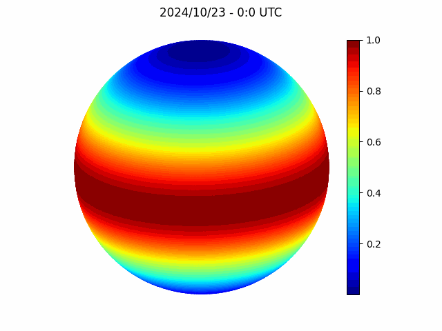

# Rayleigh Sky Model
Simulaiton of the [rayleigh sky model](https://en.wikipedia.org/wiki/Rayleigh_sky_model) using python.

### Angle of Polarization (°)
Angle $\alpha$ of polarization of $\vec{E}$ at any observable point $P$ can be found with:

$$\alpha = arctan(\frac{sin(\theta)cos(\theta_s)-cos(\theta)cos(\varphi-\varphi_s)sin(\theta_s)}{sin(\varphi-\varphi_s)sin(\theta_s)})$$

$\theta \to$  Angle from zenith to observed point $P$ (angle 
complimentary to the elevation)

$\varphi \to$ Angle from $0°$ due north to observed point $P$ (same angle as the azimuth)

$\theta_s \to$ Angle from zenith to the sun (angle complimentary to the elevation)

$\varphi_s \to$ $\varphi \to$ Angle from $0°$ due north to the sun (same angle as the azimuth)

### Degree of Polarization (%)
The degree of polarized light $\delta$ at any observable point $P$ can be found with:

$$\delta = \frac{\delta_{max}sin^2(\gamma)}{1+cos^2(\gamma)}$$

$\gamma \to$ Angular distance between the Sun and the observed point. Can be expressed as:

$\gamma = arccos(cos(\theta)cos(\theta_s)+sin(\theta)sin(\theta_s)cos(\varphi-\varphi_s))$

